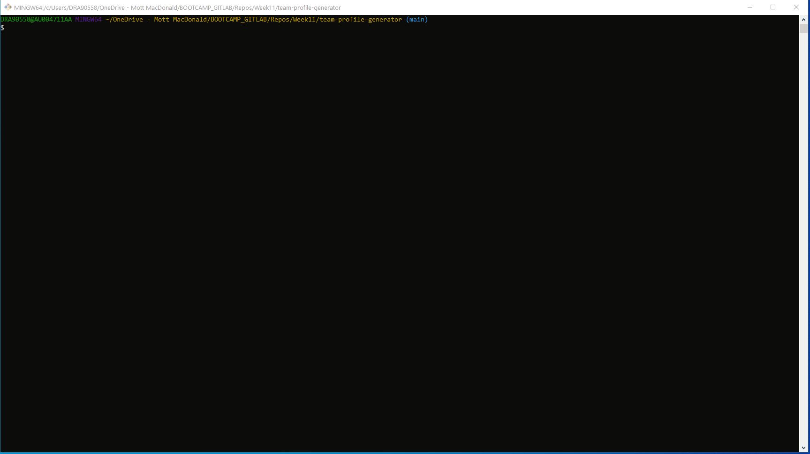
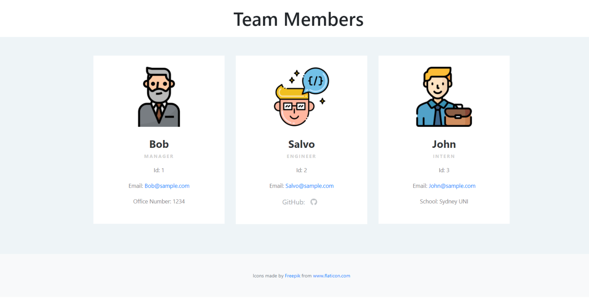
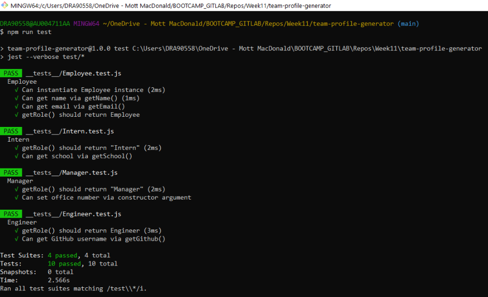
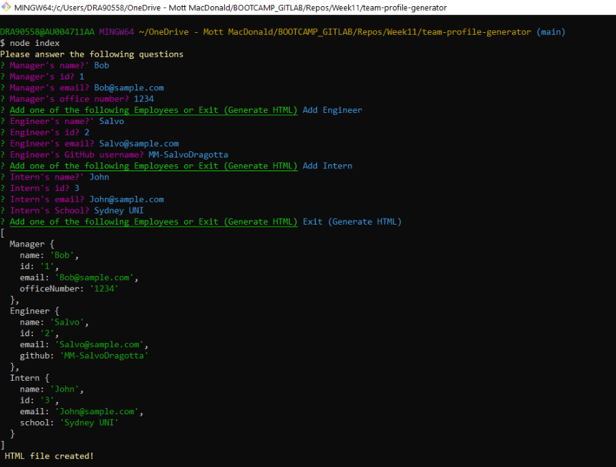

# Software Engineering Team Generator with Node.js

<h2>Table of Contents</h2>

- [Description](#description)
- [Installation](#installation)
- [Usage](#usage)
- [License](#license)
- [Contributing](#contributing)
- [Follow](#follow)

----

## Description

This Node.js command-line application takes in information (using the [Inquirer package](https://www.npmjs.com/package/inquirer)) about employees on a software engineering team, then generates an HTML webpage that displays summaries for each person. 

The following animation shows the Team Profile Generator appearance and functionality:

### Mock-Up
The following image shows a mock-up of the generated HTML’s appearance 

A sample index.html generated using the application can be found here 
[Team Profile Generator HTML ](./dist/index.html) 

----

## Installation

💾     

`npm install`

----

## Usage

💻   
  
Run the following command at the root of your project and answer the prompted questions

`node index.js`

🎥  A video of the typical user flow through the application can be found here [Team Profile Generator Video](./assets/images/TeamGenerator.mp4) 

Also refer to the following screenshots

  

  

----

## License

This App is covered by the \

----

## Contributing

Fork this repository if you want to contribute\

----

## Follow
\

